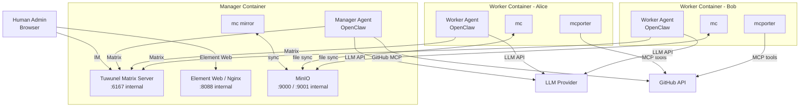

# HiClaw Architecture

## System Overview

HiClaw is an Agent Teams system that enables multiple AI Agents to collaborate via instant messaging (Matrix protocol) with human oversight.



## Component Details

### Matrix Homeserver (Tuwunel)

Tuwunel is a high-performance Matrix Homeserver (conduwuit fork):
- Runs on port 6167
- Manages all IM communication between Human, Manager, and Workers
- Uses `CONDUWUIT_` environment variable prefix
- Single-step registration with token (no UIAA flow)

### HTTP File System (MinIO)

MinIO provides centralized file storage accessible via HTTP:
- Port 9000 (API) and 9001 (Console)
- `mc mirror --watch` provides real-time local<->remote sync
- All Agent configs, task briefs, and results stored here

### Manager Agent (OpenClaw)

The Manager Agent coordinates the entire team:
- Receives tasks from human via Matrix DM **or any other configured channel** (Discord, Feishu, Telegram, etc.)
- Creates Workers (Matrix accounts + config files + environment variables)
- Assigns and tracks tasks
- Runs heartbeat checks (triggered by OpenClaw's built-in heartbeat mechanism)
- Manages credentials and access control
- Automatically stops idle Worker containers and restarts them on task assignment
- Monitors Matrix room session expiry and sends keepalive messages on request
- Routes daily notifications to the admin's **primary channel** (with Matrix DM fallback)
- Supports **cross-channel escalation**: sends urgent questions to the admin's primary channel and routes replies back to originating Matrix rooms
- Manages LLM API keys and MCP Server credentials, securely injected into Worker containers via environment variables

### Worker Agent (OpenClaw)

Workers are lightweight, stateless containers:
- Pull all config from MinIO on startup
- Communicate via Matrix Rooms (Human + Manager + Worker in each Room)
- Use mcporter CLI to call MCP Server tools (GitHub, etc.)
- LLM API keys and MCP credentials injected via environment variables from Manager, not stored in config files
- Can be destroyed and recreated without losing state
- Manager can create Workers directly via the host container runtime socket (Docker/Podman), or provide a `docker run` command for manual/remote deployment

## Security Model

```
┌──────────────────────────────────────┐
│         Manager Container             │
│   Environment Variable Injection      │
│         (Docker --env)                │
│                                      │
│  HICLAW_LLM_API_KEY (LLM secret)      │
│  HICLAW_GITHUB_TOKEN (MCP credential) │
└──────────────────────────────────────┘
           │
           ▼
┌──────────────────────────────────────┐
│         Worker Container              │
│   OpenClaw reads environment vars     │
│                                      │
│  openclaw.json: "$HICLAW_LLM_API_KEY"│
│  mcporter-servers.json: env injection │
└──────────────────────────────────────┘
```

- LLM API keys and MCP Server credentials (e.g., GitHub Token) are stored in Manager container environment variables
- When creating Workers, Manager injects credentials into Worker containers via Docker `--env` flags
- Worker's `openclaw.json` uses `$HICLAW_LLM_API_KEY` syntax (single dollar sign) to instruct OpenClaw to read from environment variables at runtime
- MCP Server credentials are passed to local MCP processes via the `env` field in `mcporter-servers.json`
- No sensitive credentials are stored in MinIO or configuration files

## Communication Model

All communication happens in Matrix Rooms with Human-in-the-Loop:

```
Room: "Worker: Alice"
├── Members: @admin, @manager, @alice
├── Manager assigns task -> visible to all
├── Alice reports progress -> visible to all
├── Human can intervene anytime -> visible to all
└── No hidden communication between Manager and Worker
```

## File System Layout

### Manager Workspace (local only, host-mountable)

The Manager's own working directory lives on the host and is bind-mounted into the container. It is never synced to MinIO.

- **Default host path**: `~/hiclaw-manager` (configurable via `HICLAW_WORKSPACE_DIR` at install time)
- **Container path**: `/root/manager-workspace` (set as `HOME` for the Manager Agent process, so `~` resolves here)

```
~/hiclaw-manager/            # Host path (bind-mounted to /root/manager-workspace in container, which is the agent's HOME)
├── SOUL.md                  # Manager identity (copied from image on first boot)
├── AGENTS.md                # Workspace guide
├── HEARTBEAT.md             # Heartbeat checklist
├── openclaw.json            # Generated config (regenerated each boot)
├── skills/                  # Manager's own skills
├── worker-skills/           # Worker skill definitions (pushed to workers via mc cp)
├── workers-registry.json    # Worker skill assignments and room IDs
├── state.json               # Active task state
├── worker-lifecycle.json    # Worker container status and idle tracking
├── primary-channel.json     # Admin's preferred primary channel for proactive notifications
├── trusted-contacts.json    # Non-admin contacts allowed to converse with the Manager
├── coding-cli-config.json   # Coding CLI delegation config (enabled, cli tool name)
├── yolo-mode                # If present, enables YOLO mode (autonomous decisions, no admin prompts)
├── .session-scan-last-run   # Timestamp of last Matrix session expiry scan
└── memory/                  # Manager's memory files (MEMORY.md, YYYY-MM-DD.md)
```

### MinIO Object Storage (shared between Manager and Workers)

Synced to `~/hiclaw-fs/` locally on the Manager side via `mc mirror`.

```
MinIO bucket: hiclaw-storage/   (mirrored to ~/hiclaw-fs/ on Manager)
├── agents/
│   ├── alice/           # Worker Alice config
│   │   ├── SOUL.md
│   │   ├── openclaw.json
│   │   ├── skills/
│   │   └── mcporter-servers.json
│   └── bob/             # Worker Bob config
├── shared/
│   ├── tasks/           # Task specs, metadata, and results
│   │   └── task-{id}/
│   │       ├── meta.json    # Task metadata (assigned_to, status, timestamps)
│   │       ├── spec.md      # Complete task spec (written by Manager)
│   │       ├── base/        # Manager-maintained reference files (codebase, docs, etc.)
│   │       └── result.md    # Task result (written by Worker)
│   └── knowledge/       # Shared reference materials
└── workers/             # Worker work products
```
